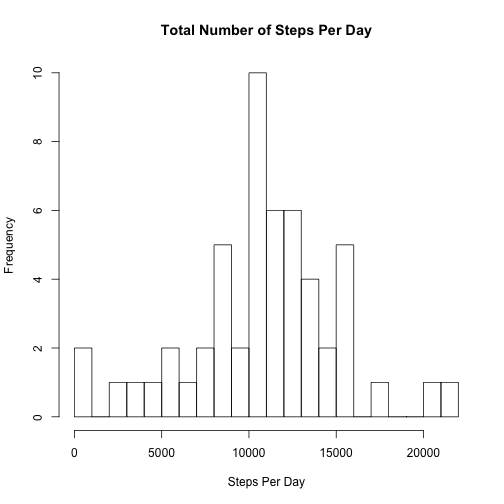
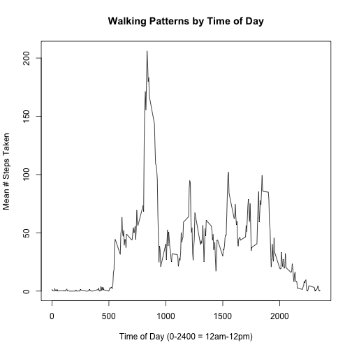
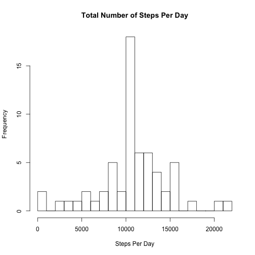
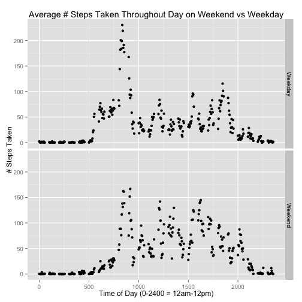

#Peer Assessment 1


```r
knitr::opts_chunk$set(echo=TRUE) ##ensures that all code chunks in document are set to display code
```

###Loading and preprocessing the data

####1. Load the data 

First, create a directory where the assignment files will be downloaded

```r
main.dir <- "/Users/kurtschuepfer1" ##Customize this path to identify your own main directory. Here is where a subdirectory will be created and where the assignment's files will be unzipped.
sub.dir <- "RepRes_Ass1"

if (file.exists(sub.dir)){
    setwd(file.path(main.dir, sub.dir))
} else {
    dir.create(file.path(main.dir, sub.dir))
    setwd(file.path(main.dir, sub.dir))

}
```

```
## Warning in dir.create(file.path(main.dir, sub.dir)):
## '/Users/kurtschuepfer1/RepRes_Ass1' already exists
```

Second, install the "downloader" package for quick unzipping


```r
install.packages("downloader", repos = "http://cran.us.r-project.org")
```

```
## Error in install.packages : Updating loaded packages
```

```r
library(downloader)
```


Third, download data from web and extract it to newly created directory

```r
dataURL <- "https://d396qusza40orc.cloudfront.net/repdata%2Fdata%2Factivity.zip"
download(dataURL, dest="dataset.zip", mode="wb") 
unzip("dataset.zip", exdir = "./")
```

Fourth, load the data into R

```r
data <- read.csv("activity.csv", stringsAsFactors = FALSE)
```


####2. Process/transform the data into a suitable format for analysis

In order to perform the analysis, we will have to change the format of the "date" variable. Specifically, we will change it from "factor" to "date" format. 

```r
data$date <- as.Date(data$date)
```

###What is mean total number of steps taken per day?  

For this part of the assignment, you can ignore the missing values in the dataset.  

First, create a data set that excludes any rows containing NA.

```r
data_nona1 <- data[which(!is.na(data$steps)),] ##creates a new data set with NA's on steps variable removed
data_nona2 <- data_nona1[which(!is.na(data_nona1$date)),] #filters out NA's on date variable within previous data set (data_nona1)
data_nona <- data_nona2[which(!is.na(data_nona2$interval)),] #filters out NA's on interval variable within previous data set (data_nona2)
```

Note: in this particular dataset, there were no NA's in either the "date" or the "interval" variables. Thus, our two previous steps were technically unnecessary. However, I am leaving these steps in for illustrative purposes, to show how one would approach such an analysis in the likely event that a future dataset is not as convenient as this one. 

####1) Calculate the total number of steps taken per day


```r
stepsperday <- tapply(data_nona$steps, data_nona$date, sum)
```

####2) Make a histogram of the total number of steps taken each day

```r
hist(stepsperday, 20, main = "Total Number of Steps Per Day", xlab = "Steps Per Day")
```

 

####3) Calculate and report the mean and median of the total number of steps taken per day


```r
meanstepsperday <- mean(stepsperday)
meanstepsperday
```

```
## [1] 10766.19
```
The average total number of steps taken per day is ~10,766.


```r
medianstepsperday <- median(stepsperday)
medianstepsperday
```

```
## [1] 10765
```
The median total number of steps taken per day is 10,765.

###What is the average daily activity pattern?
####1) Make a time series plot (i.e. type = "l") of the 5-minute interval (x-axis) and the average number of steps taken, averaged across all days (y-axis)

For this question, use the dataset with all NA's removed, otherwise the *tapply* output will be NA.

```r
dailyactivity <- tapply(data_nona$steps, data_nona$interval, mean)
plot(names(dailyactivity), dailyactivity, type = "l",
     xlab = "Time of Day (0-2400 = 12am-12pm)", ylab = "Mean # Steps Taken", 
     main = "Walking Patterns by Time of Day")
```

 

####2) Which 5-minute interval, on average across all the days in the dataset, contains the maximum number of steps?


```r
dailyactivity[which.max(dailyactivity)]
```

```
##      835 
## 206.1698
```
The maximum average number of steps taken is 206.17, which occurs at the 835 interval (this corresponds to the time period between 8:35-8:40pm). 

###Imputing missing values

Note that there are a number of days/intervals where there are missing values (coded as NA). The presence of missing days may introduce bias into some calculations or summaries of the data.

####1) Calculate and report the total number of missing values in the dataset (i.e. the total number of rows with NAs)


```r
length(which(is.na(data)))
```

```
## [1] 2304
```
There are 2304 rows with missing values in this dataset.

####2) Devise a strategy for filling in all of the missing values in the dataset. The strategy does not need to be sophisticated. For example, you could use the mean/median for that day, or the mean for that 5-minute interval, etc.


```r
data_filled_missing <- data
data_filled_missing[which(is.na(data_filled_missing$steps)),1] <- dailyactivity[as.character(data_filled_missing[which(is.na(data_filled_missing$steps)),3])]
```
This fills in the missing data points with the mean value for its corresponding interval

####3) Create a new dataset that is equal to the original dataset but with the missing data filled in.

This was done in the previous step. To verify that there are no longer any missing values, run the following code:

```r
length(which(is.na(data_filled_missing))) 
```

```
## [1] 0
```
There are now 0 missing values in the current dataset.

####4) Make a histogram of the total number of steps taken each day and Calculate and report the mean and median total number of steps taken per day. Do these values differ from the estimates from the first part of the assignment? What is the impact of imputing missing data on the estimates of the total daily number of steps?

First, make the histogram.

```r
hist(tapply(data_filled_missing$steps, data_filled_missing$date, sum), 20,
main = "Total Number of Steps Per Day", xlab = "Steps Per Day")
```

 

Second, assign the tapply data to a new variable

```r
stepsperday_filled_missing <- tapply(data_filled_missing$steps, data_filled_missing$date, sum)
```

Use that variable to calculate the new mean and median # of steps

```r
meanstepsperday_filled_missing <- mean(stepsperday_filled_missing)
meanstepsperday_filled_missing
```

```
## [1] 10766.19
```
The mean value is 10766.19.


```r
medianstepsperday_filled_missing <- median(stepsperday_filled_missing)
medianstepsperday_filled_missing
```

```
## [1] 10766.19
```
The median value is 10766.19.

###Are there differences in activity patterns between weekdays and weekends?

For this part the weekdays() function may be of some help here. Use the dataset with the filled-in missing values for this part.

####1) Create a new factor variable in the dataset with two levels – “weekday” and “weekend” indicating whether a given date is a weekday or weekend day.


```r
data_filled_missing$weekday <- weekdays(data_filled_missing$date)
data_filled_missing$typeofday <- ifelse(weekdays(data_filled_missing$date) %in% 
        c("Saturday", "Sunday"), "Weekend", "Weekday")
data_filled_missing$typeofday <- as.factor(data_filled_missing$typeofday)
```


####2) Make a panel plot containing a time series plot (i.e. type = "l") of the 5-minute interval (x-axis) and the average number of steps taken, averaged across all weekday days or weekend days (y-axis).

First, create separate dataframes for both weekday and weekend data.

```r
split <- split(data_filled_missing, data_filled_missing$typeofday)
weekday.df <- split$Weekday
weekday.dfx <- data.frame(mean=tapply(weekday.df$steps, weekday.df$interval, mean))
weekday.dfx$typeofday = rep("Weekday", nrow(weekday.dfx))
weekday.dfx <- cbind(interval = rownames(weekday.dfx), weekday.dfx)

weekend.df <- split$Weekend
weekend.dfx <- data.frame(mean=tapply(weekend.df$steps, weekend.df$interval, mean))
weekend.dfx$typeofday = rep("Weekend", nrow(weekend.dfx))
weekend.dfx <- cbind(interval = rownames(weekend.dfx), weekend.dfx)
```

Then, bind these two dataframes together and put into format that is compatible with ggplot2.


```r
binded.df <- rbind(weekday.dfx, weekend.dfx)
binded.df$interval <- as.character(binded.df$interval)
binded.df$interval <- as.numeric(binded.df$interval)
```

Finally, make the graph with ggplot2.

```r
library(ggplot2)
g <- ggplot(binded.df, aes(interval, mean))
p <- g + geom_point() + facet_grid(typeofday ~ .) +
        labs(title = "Average # Steps Taken Throughout Day on Weekend vs Weekday",
        x = "Time of Day (0-2400 = 12am-12pm)", y = "# Steps Taken")
print(p)
```

 

